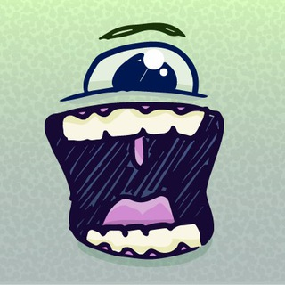

<h2 align="center"> Ado-bot 

</h2>

  A Telegram bot that generates unique avatars using <a href="https://python-telegram-bot.org/" rel="noopener noreferrer">python-telegram-bot</a>.

## Features

- **Cute Creatures**: Customizable avatars with unique eyes, nose, mouth, and colors
- **Other Avatars**: Robots, Kittens, Monsters, and Disembodied Heads

## Commands

- `/start` - Get started
- `/create` - Open avatar creation menu
- `/color` - Get color hex code and preview

## Quick Start

1. Use `/create` to open the menu
2. Choose avatar type:
   - For cute creatures: Select features or use custom settings
   - For others: Enter a name (e.g., `@avatarGenBot robot alfred`)
3. Get your avatar!

## APIs

The bot uses two main APIs for avatar generation:
- **Adorable Avatars**: Creates cute, customizable avatars with unique combinations of eyes, nose, mouth, and colors
- **Robohash**: Generates unique avatars based on text input, perfect for robots, kittens, monsters, and disembodied heads

## Built With

- [python-telegram-bot](https://python-telegram-bot.org/)
- [Adorable Avatars API](http://api.adorable.io/)
- [Robohash](https://robohash.org/)

## Support

If you find this bot helpful, consider buying me a coffee! ☕

